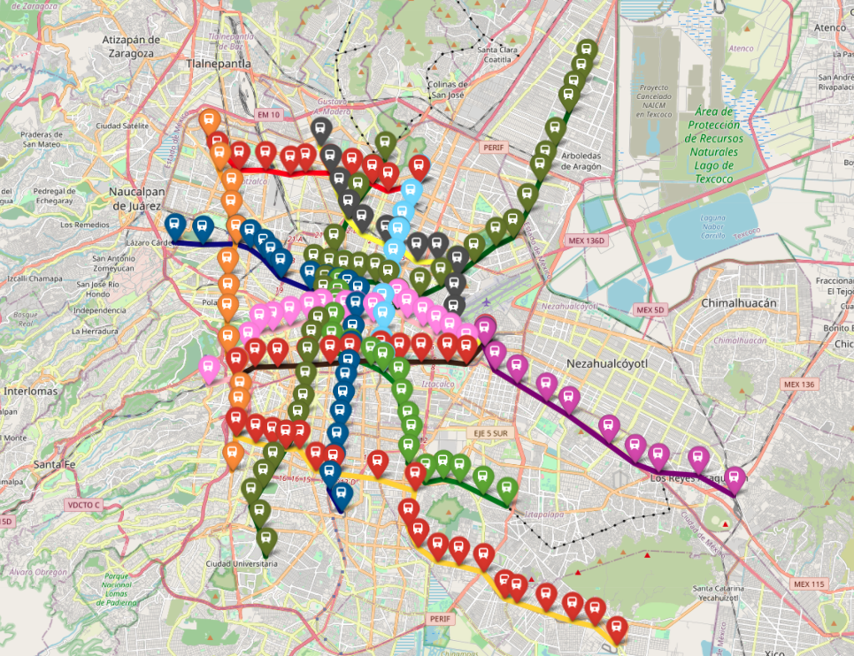

# TrainMap
Mapa creado a partir de la **[APimetro](https://github.com/galigaribaldi/Apimetro)**, que es donde recibe sus datos. El mapa contempla las 12 rutas conocidas en Ciudad de México

- Línea 1: Rosa Mexicano
- Línea 2: Azul
- Línea 3: Verde Olivo
- Línea 4: Cian
- Línea 5: Amarillo
- Línea 6: Rojo
- Línea 7: Naranja
- Línea 8: Verde
- Línea 9: Café
- Línea A: Morado 
- Línea B: Verde y gris
- Línea 12: Oro

Junto con las líneas planeadas y planteadas en 1969, las cuales contemplan las siguientes características:

- Anillo Periférico Interior
- Anillo Periférico Exterior
- Lineas de conección entre anillos
- Líneas de desahogue
- Líneas principales no planteadas en Ciudad de México

