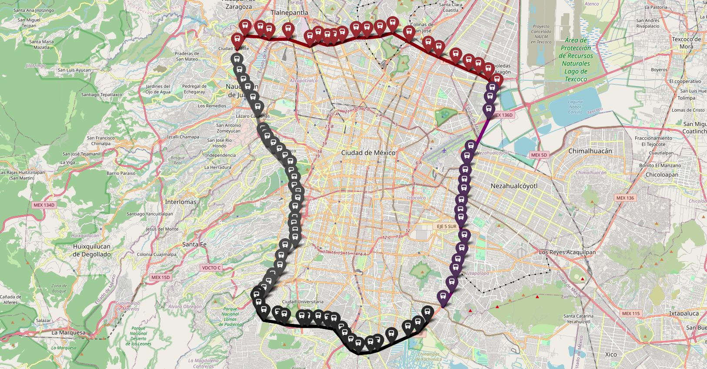
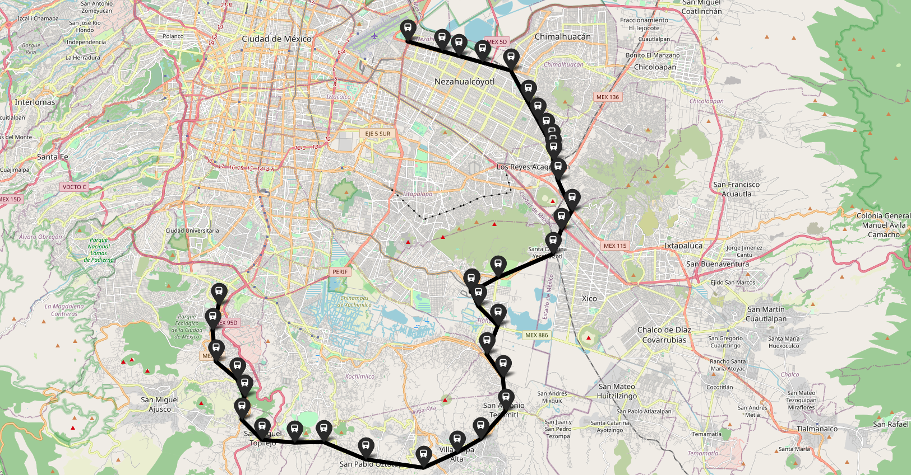
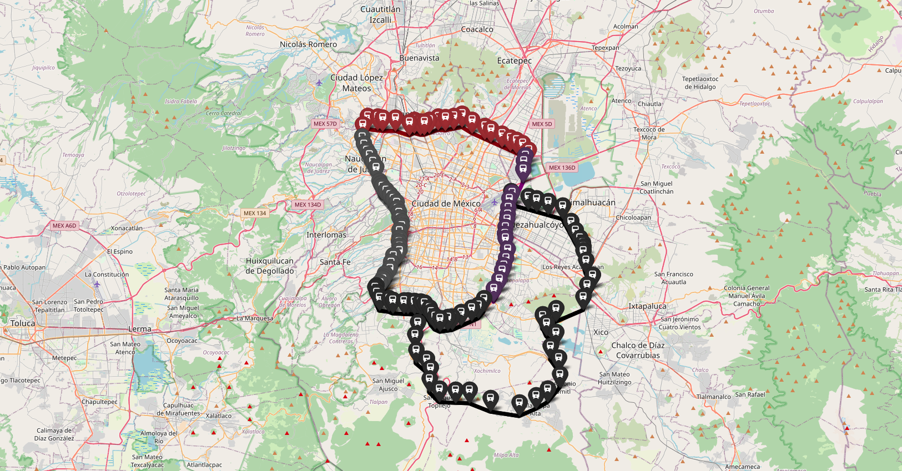

# TrainMap
Mapa creado a partir de la **[APimetro](https://github.com/galigaribaldi/Apimetro)**, que es donde recibe sus datos.  
El mapa contempla las 12 rutas conocidas en Ciudad de México, a las cuales les llamaremos **prinicipales**

- Línea 1: Rosa Mexicano (Observatorio Pantitlán)
- Línea 2: Azul (Cuatro Caminos – Tasqueña)
- Línea 3: Verde Olivo (Indios Verdes – Universidad)
- Línea 4: Cian (Martín Carrera – Santa Anita)
- Línea 5: Amarillo (Politécnico – Pantitlán)
- Línea 6: Rojo (El Rosario – Martín Carrera)
- Línea 7: Naranja (El Rosario – Barranca del Muerto)
- Línea 8: Verde (Garibaldi/Lagunilla – Constitución de 1917)
- Línea 9: Café (Tacubaya – Pantitlán)
- Línea A: Morado (Pantitlán – La Paz)
- Línea B: Verde y gris (Ciudad Azteca – Buenavista)
- Línea 12: Dorada (Mixcoac – Tláhuac)

Para las periférias de la Ciudad de México se contemplan 2 anillos:
**Periférico Interior**
- Linea 71 Anillar Sur
- Linea 72 Anillar Poniente
- Linea 73 Anillar Norte
- Linea 74 Anillar Oriente

**Periférico Exterior**
- Linea 75 Anillar Sur
- Linea 76 Anillar Oriente

**Mapa Anillar Completo (Interior - Exterior)**
