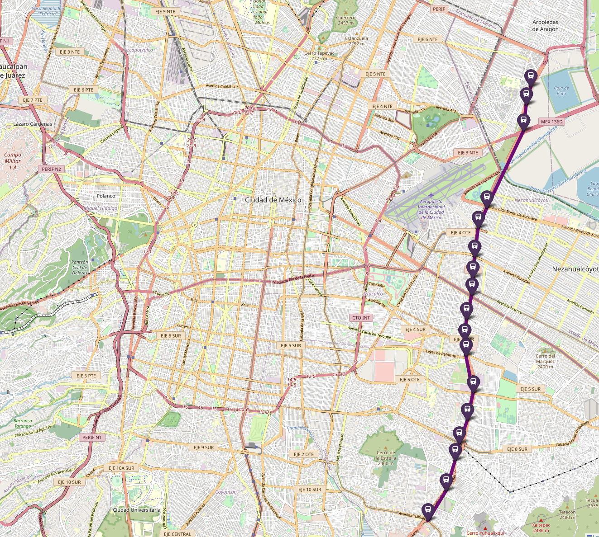
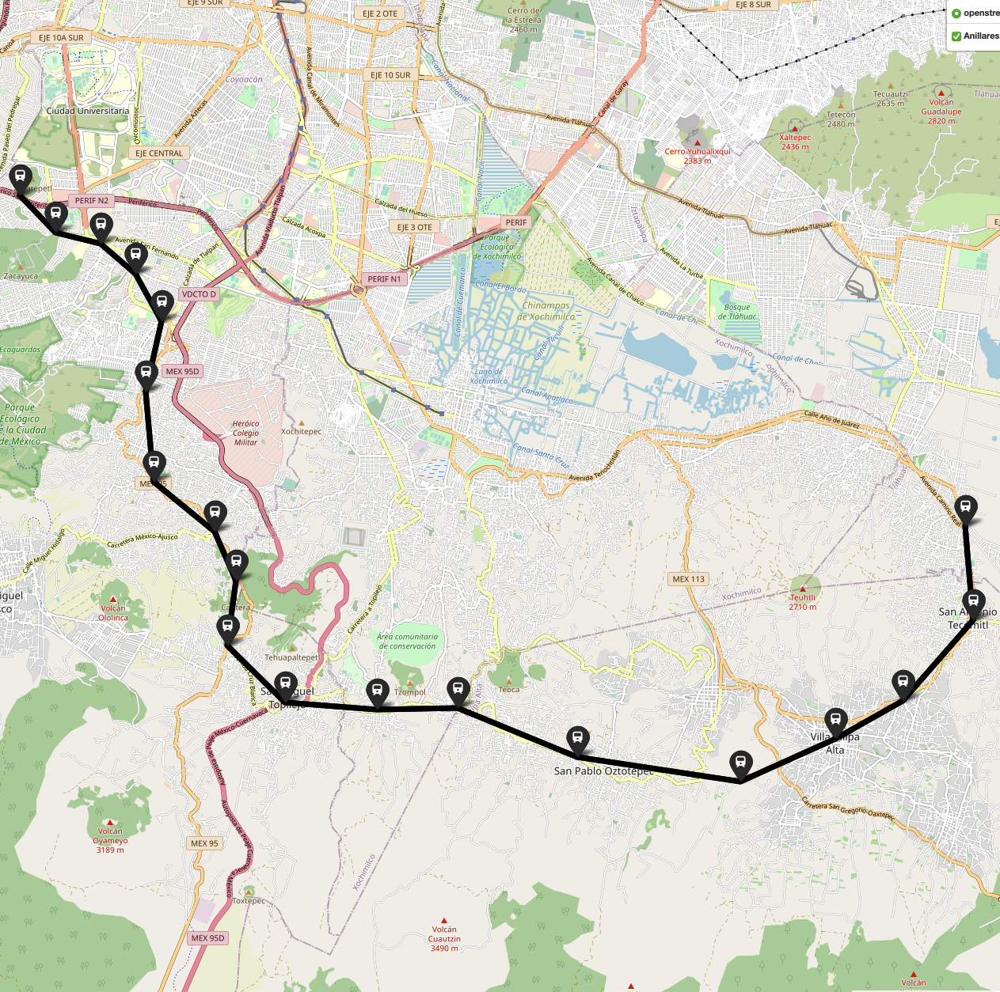
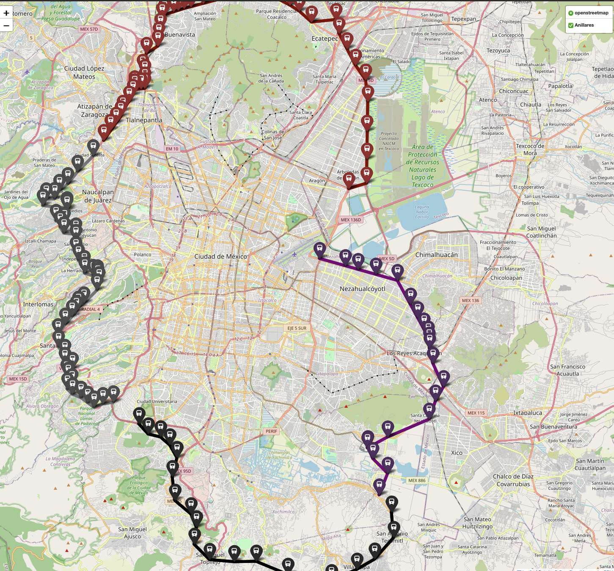

# TrainMap
Mapa creado a partir de la **[APimetro](https://github.com/galigaribaldi/Apimetro)**, que es donde recibe sus datos.  
El mapa contempla las 12 rutas conocidas en Ciudad de México, a las cuales les llamaremos **prinicipales**
## Líneas Principales
- Línea 1: Rosa Mexicano (Observatorio Pantitlán)
- Línea 2: Azul (Cuatro Caminos – Tasqueña)
- Línea 3: Verde Olivo (Indios Verdes – Universidad)
- Línea 4: Cian (Martín Carrera – Santa Anita)
- Línea 5: Amarillo (Politécnico – Pantitlán)
- Línea 6: Rojo (El Rosario – Martín Carrera)
- Línea 7: Naranja (El Rosario – Barranca del Muerto)
- Línea 8: Verde (Garibaldi/Lagunilla – Constitución de 1917)
- Línea 9: Café (Tacubaya – Pantitlán)
- Línea A: Morado (Pantitlán – La Paz)
- Línea B: Verde y gris (Ciudad Azteca – Buenavista)
- Línea 12: Dorada (Mixcoac – Tláhuac)
- Línea 81: Verde (Taxqueña - Villa Alta)

Para las periférias de la Ciudad de México se contemplan 2 anillos:
## Anillo Periférico Interior (API)
- Linea 71: Periférico Interior Sur *"Luis Cabrera - Base Canal de Chalco"* (Negro)

- Linea 72: Periférico Interior Poniente *"San Antonio Elevado - Parque Naucalli"* (Gris)

- Linea 73: Periférico Interior Norte *"Ciudad Satélite - Colonias de Aragón"* (Rojo)

- Linea 74: Periférico Interior Oriente *"FES Aragón Periférico Oriente/Periférico* (Morado)

**Mapa Completo del anillo Interior**

## Anillo Periférico Exterior (APE)
- Linea 75: Periférico Exterior Sur *"Jardínes del Pedregal - Distrito 10 La cruz"*(Negro)

- Linea 76: Periférico Exterior Poniente *"Luis Cabrera - Satélite"*(Gris)

- Linea 77: Periférico Exterior Norte *"Circunvalación - Sonapi"* (Rojo)

- Linea 78: Periférico Exterior Oriente *"Alameda Oriente - Distrito 10 Los Olivos"* (Morado)

**Mapa Completo del anillo Exterior**

**Mapa Anillar Completo (Interior - Exterior)**
